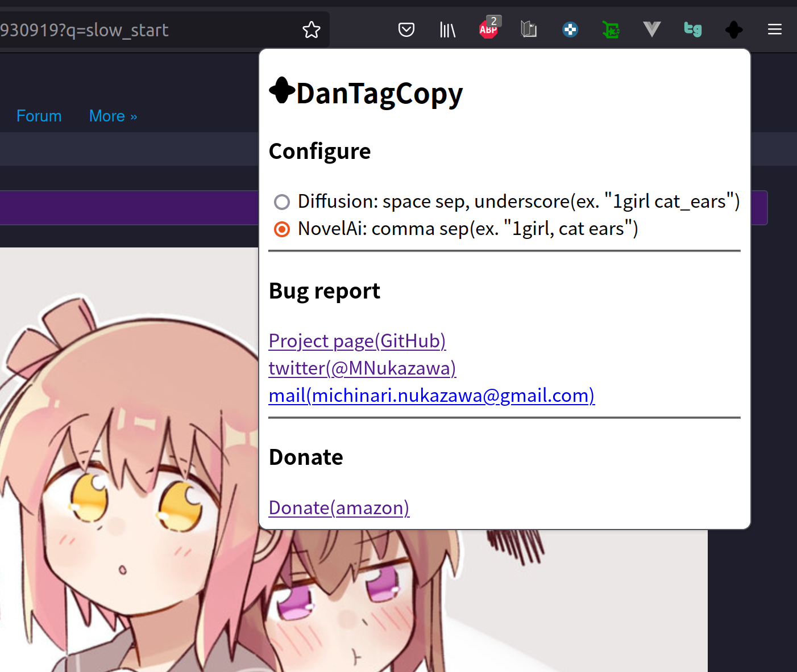

DanTagCopy - diffusion tags collecter from danbooru to clipboard WebExtensions
----

In danbooru page collect tags for diffusion prompt.  
danboooruページ上から画像のタグを取得できます。  
  
danbooruのページで見ている画像に付けられたタグを、クリップボードに集めるFireFoxアドオン,Chrome拡張です。  
diffusionのプロンプトに使うタグを集める作業を単純化して呪文探しを助けます。  
  

  

プロンプトはStableDifussion, NovelAI向けに変換することができます。  

  

# 使い方
- 生成したい画像を思い浮かべながら[danbooru][danbooru]で画像を探す。
- 見つけた画像のページで右クリックしてDanTagCopyを実行。
- クリップボードにタグがコピーされる。
- StableDiffusion, NodelAIにプロンプトを貼り付けて画像を生成！

# Install
## Chrome
- zipファイルを[Download][Download]する。  
- zipファイルを解凍。  
- Chromeの拡張機能から「パッケージ化されていない拡張機能を読み込む」で解凍したディレクトリを指定する。  
## FireFox
[Firefox Add-ons](https://addons.mozilla.org/ja/firefox/addon/dantagcopy/)  
または、
- zipファイルを[Download][Download]する。  
- FireFoxの拡張機能から「一時的なアドオンを読み込む」でダウンロードしたzipファイルを指定する。  

# License
Public Domain  

# TODO
- タグの自動カスタム
  - 自動タグソート(どのような順番に？)
  - 自動追加・除外タグリスト
低優先度・要検討
- 表記設定切り替え時にクリップボードへ反映  
- ブラウザシークレットモード対応  

# Contact
mail: [michinari.nukazawa@gmail.com][mailto]  
twitter: [@MNukazawa][twitter]  

Develop by Michinari.Nukazawa, in project "[daisy bell][pixiv_booth_project_daisy_bell]".  

[danbooru]: https://danbooru.donmai.us/
[download]: https://github.com/MichinariNukazawa/DanTagCopy_diffusion_tags_clipboard_webextension/releases/
[pixiv_booth_project_daisy_bell]: https://daisy-bell.booth.pm/
[mailto]: mailto:michinari.nukazawa@gmail.com
[twitter]: https://twitter.com/MNukazawa
